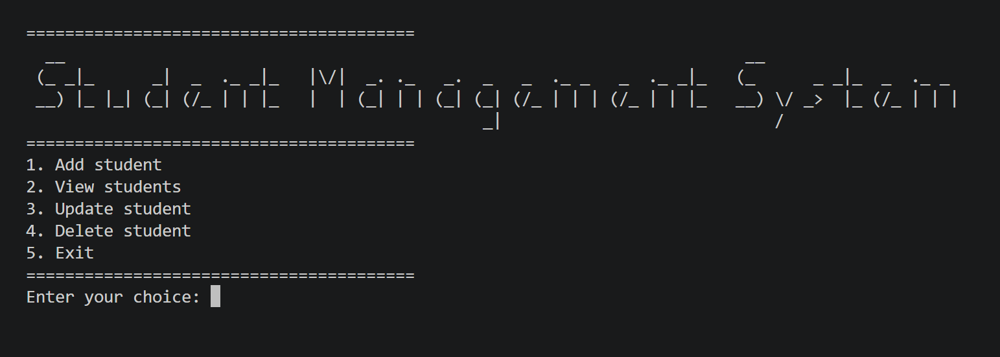
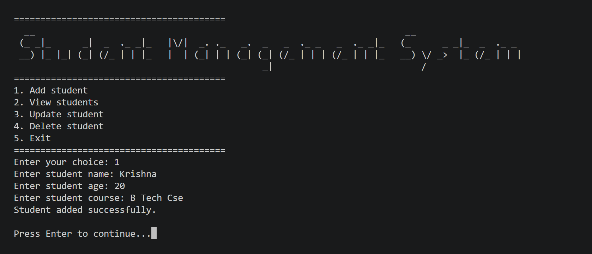
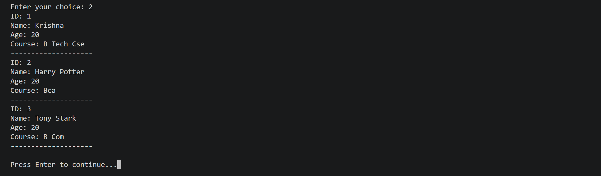
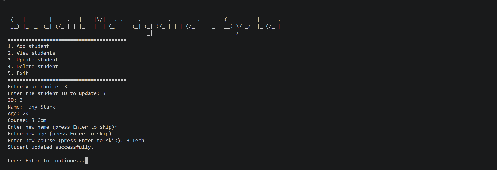
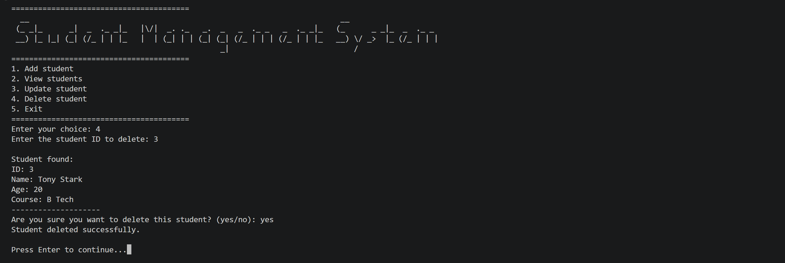

# 🚀 Student Management System (Python CLI)

A modular and well-structured **Student Management System** built using Python.
This project demonstrates a clean backend-like architecture using a **Command Line Interface (CLI)**.

---

## ✨ Features

* ➕ Add new students
* 📋 View all students
* ✏️ Update student details
* ❌ Delete students with confirmation
* ✅ Strong input validation (model-based)
* 💾 Persistent storage using JSON
* 🔄 Flexible CLI commands (aliases supported)
* 🧩 Clean modular architecture

---

## 🖼️ Project Demo

### 🏠 Main Menu



### ➕ Add Student



### 📋 View Students



### ✏️ Update Student



### ❌ Delete Student



---

## 📁 Project Structure

```id="9m0s1x"
student-manager-system/
│
├── main.py        # Entry point (CLI menu + routing)
├── services.py    # Business logic (CRUD operations)
├── models.py      # Student model (validation + behavior)
├── mappers.py     # Dict ↔ Object conversion
├── storage.py     # JSON file handling
├── utils.py       # Helper functions
├── students.json  # Data storage
└── README.md
```

---

## ⚙️ Tech Stack

* Python 3.x
* Standard Library only (`json`, `os`)
* CLI-based application

---

## ▶️ How to Run

```bash id="r63r6m"
git clone https://github.com/Krishna5601-Cpu/student-manager-system.git
cd student-manager-system
python main.py
```

---

## 💻 Available Commands

| Action         | Commands            |
| -------------- | ------------------- |
| Add Student    | 1, add, add student |
| View Students  | 2, view             |
| Update Student | 3, update           |
| Delete Student | 4, delete           |
| Exit           | 5, exit, quit       |

---

## ✅ Validation Rules

* Name must be at least 2 characters
* Age must be between 18 and 25
* Course must not be empty

All validation is enforced inside the **Student model**, ensuring consistent and safe data handling.

---

## 🔒 Data Storage

* Data is stored locally in `students.json`
* Uses a mapper layer for:

```id="tvq0bl"
JSON ⇄ Python Objects
```

---

## 👨‍💻 Author

**Krishna**
Aspiring Backend Developer 🚀

---
